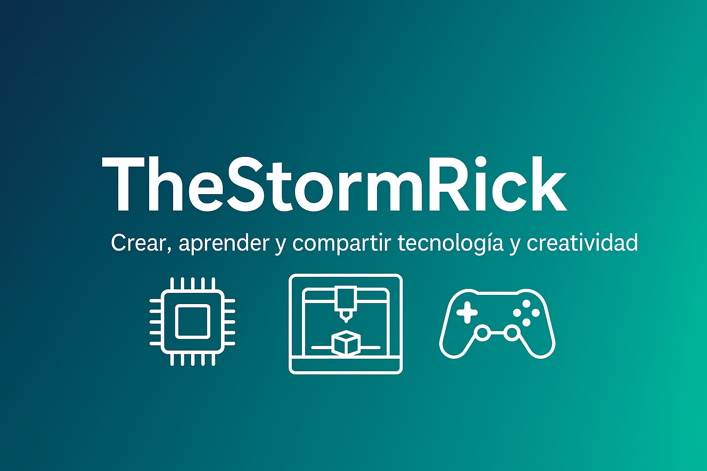

# 👋 ¡Hola! Soy TheStormRick

  

🛠️ Técnico en sistemas, electrónica e impresión 3D  
🎮 Apasionado por el desarrollo de videojuegos y la programación  
🧠 Entusiasta del aprendizaje continuo y la creación tecnológica

---

## 🧩 Sobre mí

Desde siempre he sentido una gran pasión por la tecnología, la reparación de dispositivos y la creación de soluciones prácticas. Mi formación y experiencia profesional están centradas en:

- **Administración de sistemas operativos** (Windows y Linux), donde gestiono configuraciones, mantenimiento y resolución de incidencias.
- **Electrónica básica y reparación de hardware**, con experiencia en diagnóstico y arreglo de equipos electrónicos.
- **Impresión 3D**, que es una de mis grandes pasiones. Diseño y fabrico piezas funcionales que aplico en proyectos personales y profesionales.

En los últimos tiempos, he ampliado mis horizontes adentrándome en el desarrollo de videojuegos, con conocimientos en motores como **Unity (C#)** y **Godot (GDScript)**, combinando mi interés por la programación y el diseño creativo.

---

## 🎨 Impresión 3D

- Diseño 3D avanzado utilizando **Blender** y **Fusion 360**, con especial atención en la funcionalidad y optimización de piezas.
- Preparación y calibración de impresoras FDM, ajustando parámetros para mejorar la calidad y durabilidad de las impresiones.
- Creación de piezas personalizadas para reparaciones, prototipos y proyectos maker.
- Gestión de software de slicing como **Cura** y **PrusaSlicer** para preparar archivos `.gcode` eficientes.
- Documentación y mejora continua de mis procesos de impresión para garantizar reproducibilidad.

---

## 🖥️ Informática y administración de sistemas

- Gestión y mantenimiento de sistemas operativos Windows y Linux, con experiencia en línea de comandos (PowerShell y Bash).
- Instalación, configuración y mantenimiento de redes domésticas y pequeñas oficinas.
- Diagnóstico y solución de problemas hardware/software en PCs, laptops y dispositivos conectados.
- Creación de scripts de automatización para tareas repetitivas y soporte técnico.
- Uso de herramientas de control de versiones (Git) para organizar mis proyectos y colaboraciones.

---

## 🎮 Desarrollo de videojuegos

- Experiencia práctica con **Unity** y programación en **C#**, desarrollando prototipos y juegos sencillos.
- Conocimiento en **Godot Engine** y scripting con **GDScript**, aplicando principios de diseño de juego y lógica básica.
- Diseño de interfaces gráficas de usuario (UI) y creación de assets 2D/3D para videojuegos.
- Integración de recursos artísticos con la programación para crear experiencias jugables.
- Uso de control de versiones para gestionar el desarrollo y evolución de mis proyectos.

---

## 🚀 Proyectos y objetivos actuales

Actualmente estoy organizando y preparando una serie de proyectos para compartir públicamente en GitHub y plataformas como Itch.io, que incluirán:

- Juegos sencillos y demos funcionales creados en Unity y Godot.
- Scripts y herramientas para facilitar el trabajo de técnicos y makers.
- Diseños y modelos 3D listos para impresión, con documentación para su uso.

Mi objetivo es construir un portafolio sólido que refleje tanto mis habilidades técnicas como creativas, y que pueda servir para colaborar y crecer dentro de la comunidad tecnológica y creativa.

---

## 🧰 Herramientas y tecnologías favoritas

| Área                | Herramientas / Tecnologías                         |
|---------------------|--------------------------------------------------|
| Programación        | Python, C#, GDScript                              |
| Motores de juego    | Unity, Godot                                     |
| Diseño 3D           | Blender, Fusion 360                              |
| Impresión 3D        | Cura, PrusaSlicer                                |
| Sistemas operativos | Windows, Linux (Ubuntu, Debian)                  |
| Automatización      | PowerShell, Bash                                 |
| Control de versiones| Git, GitHub                                      |

---

## 📫 Conecta conmigo

¡Me encantaría conectar y compartir experiencias!

  

---

 💡 "Crear, aprender y compartir: la base para crecer en tecnología y creatividad." 💡 

